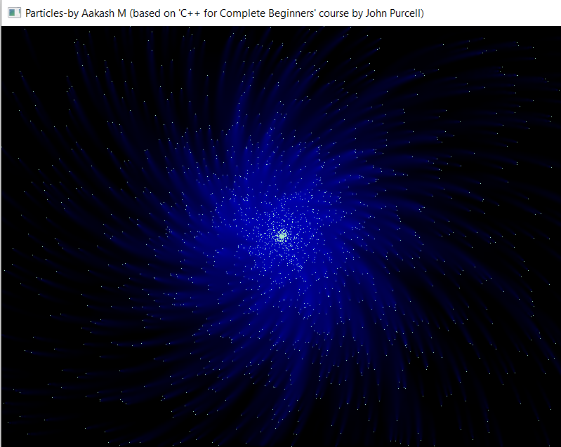

# Particle simulation using C++

The particle simulation is implemented in C++ using a powerful open-source 2D graphics library called SDL - Simple DirectMedia Layer (https://www.libsdl.org/). This project is to learn about the object oriented approach toward designing a simple particle simulation program based on the 'C++ for Complete Beginners' course by John Purcell (caveofprogramming.com).

# Build Instructions

 1. Download the Windows SDL development libraries (Visual C++ libraries) from https://www.libsdl.org/download-2.0.php, extract the zip file to the same directory where the source files are present.
 3. Configure the SDL include directories and library directories for the compiler and linker in Visual Studio 2019.
 4. Switch to Release configuration and build the project.

# Note

The compiled binaries are provided in bin folder. Download the compiled binaries for:

32-bit Operating Systems: [Download](https://github.com/aakashm101/SDLParticles/bin/x86)

64-bit Operating Systems: [Download](https://github.com/aakashm101/SDLParticles/bin/x64)